# Decoding_NER_Biases

This repository is used for a Sciences Po group project for the course '*Decoding Biases in AI*'.

**Group Members:**
> Eleanora BONEL, Ryan HACHEM, Adrien HANS, Sara KEMPPAINEN, Pablo PIGUET

---------------------------

## Methodology and application

The main inspiration for this project comes from an article entitled *Assessing Demographic Bias in Named Entity Recognition*, written by *Shubhanshu Mishra*, *Sijun He*, *Luca Belli*. In that paper, researchers, based on a set of first names for each ethnical group and a set of template sentences, are applying different NER models and are trying to see whether or not some ethnical or gender groups are less recognized by the algorithms than others. It can be found [here](https://arxiv.org/pdf/2008.03415.pdf).

The conclusion of the paper is mainly that white first names are often the best recognized ones and that the less recognized are black ones. We show below some more results described in this article. 

|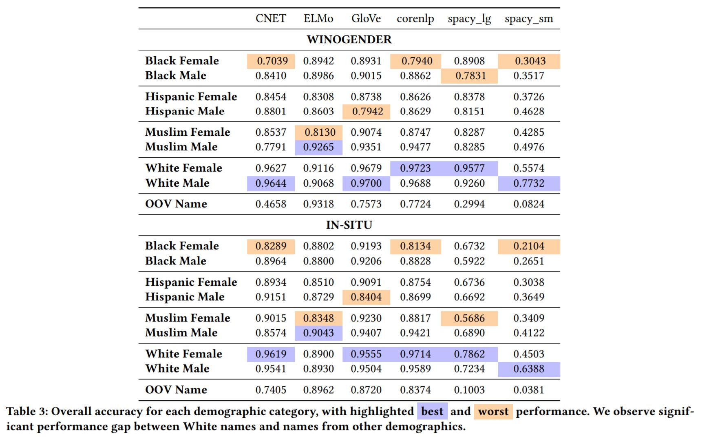|
|:--:| 
| *Some results described in the article* |

Based on that, we wanted to compute the same kind of results, but going further because we thought that some of the methodology they used was not really good enough. For instance, they are defining some first names associated exclusively to specific ethical groups, while it is obviously quite different in real life - and actually they explain that in the article.[^limits_article]

Thus, we thought of testing biases firstly one first names, with the dataset they used to begin, but then with other datasets, from the US government or the open data website of the city of New York. Then, we wanted to see if we could get the same kind of results, which is to say identifying biases in the results of the algorithms, but on other types of named entities: geographical named entities like city or country names, and company names. While there are little possible discriminations if the models are biased towards some geographical named entities, with company names it could end up discriminating some companies based on the fact their names do not sound western - at least that's what we want to check - because NER models are used sometimes to tag articles for example. 

In order to look for biases and to test the fairness of NER algorithms, we had to get two main things for each application: 
- a dataset containing what we had to test with detailed information when useful (i.e first names, city names ... with their respective ethnicity, birth year, population...)
- a sentence templates with real-life sentences in which we could test the names entities. Indeed, we had to test the hypothesis on real life sentences to achieve a real test. 

With a template and a dataset, we could then replace the named entities by the ones of the dataframe, before applying the model. To make things simpler, we give a concrete example below:

**For example:**
>The Winogender Schemas gives this type of sentence:

>*```$OCCUPATION recommended a new shampoo to $PARTICIPANT because $NOM_PRONOUN wanted to be helpful.```*

>If in the dataframe we have those three first names: `Adam`, `Camila` and `Latisha`. 

>We can build this sentence by replacing `$OCCUPATION`, `$PARTICIPANT`, `NOM_PRONOUN` by the first names: 
>```Adam recommended a new shampoo to Camila because Latisha wanted to be helpful.```

>At the end, we can get the result of the algorithm by applying the model on that sentence. We can score the result based on a simple evaluation - is the name in the prediction of the model?

Thus, by doing so on a lot of sentences and a lot of first names, we can compute the scores of each category (gender, ethnicity....) we are interested in and compare the results. We are describing below a more detailed methodology for each application, after explaining what models we are testing the hypothesis on and why we are testing several ones. 

### Models: 

For this project, we are testing the hypothesis of biases for [different models](https://spacy.io/models/en), all implemented in Spacy. These models are:

|Model name|Size|Sources of training data|
|-----|------|-----|
|`en_core_web_sm`|13 Mb|[OntoNotes 5](https://catalog.ldc.upenn.edu/LDC2013T19) (Ralph Weischedel, Martha Palmer, Mitchell Marcus, Eduard Hovy, Sameer Pradhan, Lance Ramshaw, Nianwen Xue, Ann Taylor, Jeff Kaufman, Michelle Franchini, Mohammed El-Bachouti, Robert Belvin, Ann Houston), [ClearNLP Constituent-to-Dependency Conversion](https://github.com/clir/clearnlp-guidelines/blob/master/md/components/dependency_conversion.md) (Emory University), [WordNet 3.0](https://wordnet.princeton.edu/ (Princeton University)|
|`en_core_web_md`|43 Mb|[OntoNotes 5](https://catalog.ldc.upenn.edu/LDC2013T19) (Ralph Weischedel, Martha Palmer, Mitchell Marcus, Eduard Hovy, Sameer Pradhan, Lance Ramshaw, Nianwen Xue, Ann Taylor, Jeff Kaufman, Michelle Franchini, Mohammed El-Bachouti, Robert Belvin, Ann Houston), [ClearNLP Constituent-to-Dependency Conversion](https://github.com/clir/clearnlp-guidelines/blob/master/md/components/dependency_conversion.md) (Emory University), [WordNet 3.0](https://wordnet.princeton.edu/) (Princeton University), [GloVe Common Crawl](https://nlp.stanford.edu/projects/glove/) (Jeffrey Pennington, Richard Socher, and Christopher D. Manning)|
|`en_core_web_lg`|741 Mb|[OntoNotes 5](https://catalog.ldc.upenn.edu/LDC2013T19) (Ralph Weischedel, Martha Palmer, Mitchell Marcus, Eduard Hovy, Sameer Pradhan, Lance Ramshaw, Nianwen Xue, Ann Taylor, Jeff Kaufman, Michelle Franchini, Mohammed El-Bachouti, Robert Belvin, Ann Houston), [ClearNLP Constituent-to-Dependency Conversion](https://github.com/clir/clearnlp-guidelines/blob/master/md/components/dependency_conversion.md) (Emory University), [WordNet 3.0](https://wordnet.princeton.edu/) (Princeton University), [GloVe Common Crawl](https://nlp.stanford.edu/projects/glove/) (Jeffrey Pennington, Richard Socher, and Christopher D. Manning)|
|`en_core_web_trf`|438 Mb|[OntoNotes 5](https://catalog.ldc.upenn.edu/LDC2013T19) (Ralph Weischedel, Martha Palmer, Mitchell Marcus, Eduard Hovy, Sameer Pradhan, Lance Ramshaw, Nianwen Xue, Ann Taylor, Jeff Kaufman, Michelle Franchini, Mohammed El-Bachouti, Robert Belvin, Ann Houston), [ClearNLP Constituent-to-Dependency Conversion](https://github.com/clir/clearnlp-guidelines/blob/master/md/components/dependency_conversion.md) (Emory University), [WordNet 3.0](https://wordnet.princeton.edu/) (Princeton University), [roberta-base](https://github.com/pytorch/fairseq/tree/master/examples/roberta) (Yinhan Liu and Myle Ott and Naman Goyal and Jingfei Du and Mandar Joshi and Danqi Chen and Omer Levy and Mike Lewis and Luke Zettlemoyer and Veselin Stoyanov)|

**Why do we need to test all of these models?**

Firstly, as said above, the models are not trained using the exact same method and moreover using the same datasets, so we can expect different results. Additionally, if we perform a simple test on all these models, we can clearly see that the results are quite different. 
For instance, on the test text: `I think Barack Obama met the founder of Facebook at the occasion of a release of a new NLP algorithm.`, we obtain the results below for each model: 

|Model name|Result of the test|Correct result ?|
|-----|------|------|
|`en_core_web_sm`|| :x: |
|`en_core_web_md`|| :ballot_box_with_check: |
|`en_core_web_lg`|| :x: |
|`en_core_web_trf`|| :ballot_box_with_check: |

||
|:--:|
| *Comparison of basic model performances on a test sentence.* |

We can see that only two models -`md` and `trf`- have the same -and the correct- results, recognizing `Barack Obama` as a *person* and `Facebook` as an *organization* while for instance `sm` and `md` models have recognized `NLP` as an organization name. This will be detailed in the next parts on the applications, but then the results depend greatly on the kind of model being used. 
At the end, to get a measure of the average bias - if there is one - we also computed the average score of the four models for each test. 

### :passport_control: First names 

Firstly, since we were really inspired by [the article](https://arxiv.org/pdf/2008.03415.pdf), but also because, as we explained, we thought they were not going far enough, we tested our hypothesis of existing biases in NER models on first names. 

We used the same template as in the article: the [Winogender Schemas](https://github.com/rudinger/winogender-schemas). It is a quite famous one, developed at the beginning to *"test for the presence of gender bias in automated coreference resolution systems."* It consists of 120 sentences with possible named entities: `Participant`, `Occupation` and a `Pronoun`. Yet, we must clean the sentences, firstly by deleting the possible `the` before `Participant` or `Occupation`. 

For instance, this original winogender sentence: `'The $PARTICIPANT left the $OCCUPATION a big tip because $NOM_PRONOUN had made the drink very strong.'` was replaced by this one: `$PARTICIPANT left $OCCUPATION a big tip because $NOM_PRONOUN had made the drink very strong.`. 

Secondly, we wanted to make sure there were three named entities in each sentence to make things simpler, and, at the end, we made sure the `pronoun` was a nominative one, to avoid any English mistakes when building the sentences with real names. This cleaning process was really inspired by the article. We ended up with **89 sentences**, and this was good enough for our experiments. 

Having a cleaned and good sentence template, we could then look for datasets containing first names and some attached information relative to the fields we wanted to study. We used four different datasets:
- The one of the article, giving, as we said, a list of first names for each gender and ethnical categories. 
- The US baby names at the national level
- The `Popular Baby Names` dataset made available by the Open Data Website of New York City. 
- The US baby names dataset at the state level. 

With those datasets, we could get a random sentence from the template, and replace `$Occupation`, `$Participant` and `$NOM_PRONOUN` by three random first names from the dataset for each test. We could repeat that process *n* times in order to make our results significant. 

>*note*: At the beginning, we wanted to apply this process to every possible sentence, but as we will explain later, it was not possible given our computational power. Therefore, for most of our test, we ran them on **100 000 sentences**.

**Validation process**

After applying the models on each sentence, it would return a prediction. This prediction takes the form of a list. If the named entity was completely contained inside the prediction, we attributed `1` as a score for the named entity and `0` if it was not in the prediction. This gave a score close to the accuracy for each first name. 

>**For instance**: 
>> With this kind of sentence:
>> `'Adam recommended a new shampoo to Camila because Latisha wanted to be helpful.'`<br/>
>> We can apply the model `en_core_web_lg`, and it returns this list:<br/>
>> `['Camila', 'Latisha']`<br/>
>> Thus, the score for this model of each named entity is:<br/>

|Named entity|Score|
|------------|-----|
|Adam|0|
|Camila|1|
|Latisha|1|

For the article, first names were exclusively associated to one ethnicity and one gender, so it was easy to compute the score of each category by just getting the mean of the results for each first names attributed to that category. Yet, for the other datasets, **the first names were not exclusive to only one category**. 
>For instance, for the NYC dataset, after cleaning, the first name `Ethan` was given by 4324 mothers of ethnicity `Hispanic` but also by 2270 of ethnicity `Black non hispanic`. 

||
|:--:|
|*`Ethan` was given by various ethnicities*|

This is why we had to find a way for every category to compute a mean score averaged by the weights of the first names inside it.
>For example, still on the NYC dataset, we used this kind of pseudo-code to compute the score for each ethnicity:
>>```
>>for each ethnicity:
>>  n_total=0
>>  for each name:
>>          n = number of people wearing this first name in ethnicity
>>          n_total += n
>>          sum_score += result*n
>>  score_ethnicity = sum_score/n_people
>>```

Since we just explained the general methodology used for first names, we are now going to detail the specific process we had to perform on every datasets. 

- 1- :spiral_notepad: Same first names as in the article

The first dataset we applied the models on is the one coming from the article. We thought this would be a good starting point to compute their results. It consists in a list of first names for each ethnical category and each gender, defined as below:

```yaml
#Black Female = BF_names
BF_names = ['Aaliyah', 'Ebony', 'Jasmine', 'Lakisha', 'Latisha','Latoya', 'Malika', 'Nichelle', 'Nishelle', 'Shanice','Shaniqua', 'Shereen', 'Tanisha', 'Tia', 'Yolanda','Yvette']
#Black Male = BM_names
BM_names = ['Alonzo', 'Alphonse', 'Darnell', 'Deion', 'Jamel','Jerome', 'Lamar', 'Lamont', 'Leroy', 'Lionel', 'Malik','Terrence', 'Theo', 'Torrance', 'Tyree']
#Hispanic Female = HF_names
HF_names=['Ana', 'Camila', 'Elena', 'Isabella', 'Juana', 'Luciana', 'Luisa', 'Maria', 'Mariana', 'Martina', 'Sofia','Valentina', 'Valeria', 'Victoria', 'Ximena']
#Hispanic Male = HM_names
HM_names = ['Alejandro', 'Daniel', 'Diego', 'Jorge', 'Jose', 'Juan','Luis', 'Mateo', 'Matias', 'Miguel', 'Nicolas', 'Samuel','Santiago', 'Sebastian', 'Tomas']
#Muslim Female = MF_names
MF_names = ['Alya', 'Ayesha', 'Fatima', 'Jana', 'Lian', 'Malak','Mariam', 'Maryam', 'Nour', 'Salma', 'Sana', 'Shaista','Zahra', 'Zara', 'Zoya']
#Muslim Male = MM_names
MM_names = ['Abdullah', 'Ahmad', 'Ahmed', 'Ali', 'Ayaan', 'Hamza','Mohammed', 'Omar', 'Rayyan', 'Rishaan', 'Samar','Syed', 'Yasin', 'Youssef', 'Zikri']
#White Female = WF_names
WF_names = ['Amanda', 'Betsy', 'Colleen', 'Courtney', 'Ellen','Emily', 'Heather', 'Katie', 'Kristin', 'Lauren', 'Megan','Melanie', 'Nancy', 'Rachel', 'Stephanie']
#White Male = WM_names
WM_names = ['Adam', 'Alan', 'Andrew', 'Brad', 'Frank', 'Greg','Harry', 'Jack', 'Josh', 'Justin', 'Matthew', 'Paul', 'Roger','Ryan', 'Stephen']
```
Thus, there are four ethnical and two gender categories, each of them containing 15 -or 16 for the first one- first names.
We could not apply the four models on each possible sentence. 
Indeed, there are 89 sentences in the template and 121 different first names. This number of first names would have given 1 727 880 three ordered permutations, so at the end 89 * 1 727 880 = 153 781 320 possible sentences. This was not possible given the computational power we had access to. 

We then computed random sentences - the sentence was chosen at random and the three first names for each sentence too. We ran the test on 100 000 sentences. This method already allowed us to apply the four models for a runtime of approximatively 2 hours. This runtime is mainly explained because we had to make a call to the spacy models for each sentence. 
The results we obtained are available below, in the `results` part of this page. 

As we have already explained, this test is quite limited, mainly because it is quite strange to say that a first name is mainly used by only one ethnical category. This is why - additionally to looking for other biases - we also used other datasets. 

- 2- :date: US Baby names - national level

The second dataset was a famously known one. It comes from Data.gov . A cleaned version of it is available on [kaggle](https://www.kaggle.com/kaggle/us-baby-names). As a first experimentation with this dataset, we used the national level one, to see if the results were equally distributed over the years, or if there was a bias towards - to put it simply - people having an *old* or *modern* first name. The dataset is consisting in a list of first names given to babies in the us and the count of each first names depending on the year they were born in. The considered years were the ones between 1880 and 2014. We are showing below the head of the dataset:

|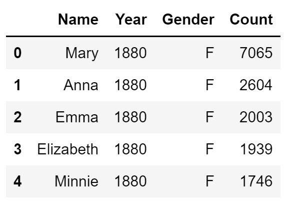|
|:--:|
|*Head of the US baby names dataset - National level*|

This dataset was already quite clean and ready to use. Yet, there were `93889` different first names in the dataset. This was way too much and not very useful considering what we wanted to study. Indeed, for instance, the first name `Enesha` was only given once in US between 1880 and 2014 so we would not get any information by considering it in our test. This is why we had to **select a set of significant first names**. We decided to take the `10` most present first names for each gender and each year. This resulted in a set of `129` first names. We thought this was a good number (not too large but not too small) and approximatively the same number as the the number of first names considered in the article. At the end, we built `100 000` sentences and apply the four models on them, enabling us to compute a score for each year, using the method described above in the pseudo-code.

- 3- :baby: Popular baby names by NYC opendata

After exploring possible biases of NER models on first names depending on the time they were the most popular, we wanted to assert what was done by the article, but on another dataset and by considering weight of each name inside each ethnicity rather than considering exclusive first names for each ethnical category. This why we used the Popular Baby Names dataset made available by New York City. It consists in several attributes, like the `Child's First Name`, the mother's ethnicity, and the gender.

|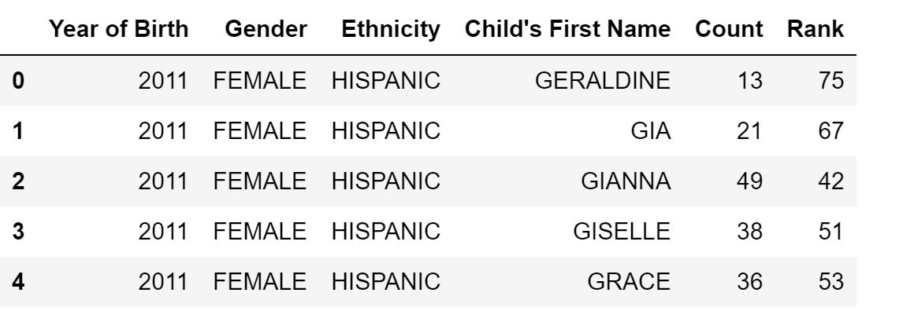|
|:--:|
|*Head of the Popular Baby Names dataset - raw*|

We had to clean this dataset a little, firstly by making sure the first names were all titled, then by replacing the names of some ethnicity and finally by aggregating the `Count` columns of each year and first name in order to get the total count of each first name for each ethnicity. Just like before, the dataset was containing too much first names to take all of them into consideration. Thus, we selected the **10** most present first names for each ethnicity and gender, giving us a list of **58** first names. We performed the analysis on 100 000 random sentences computed as explained in the other examples above. 

- 4- :us: US Baby names - sate level

To complete our exploration of possible biases in the use of NER algorithms on first names, we wanted to know if the results were different towards the places people were born in. In order to do that, we used again the US baby names dataset, but for this case on the state level. It is the exact same dataset as before, but with an additional column: the US state babies were born in. 

|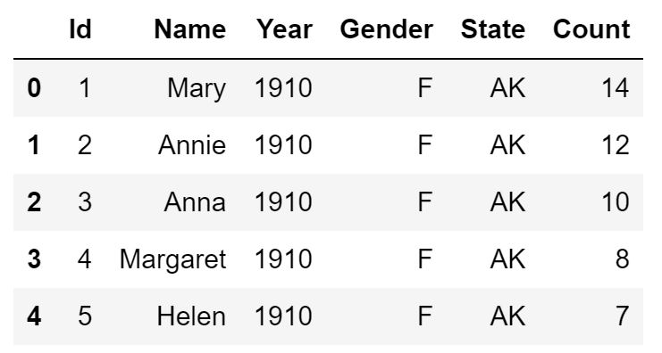|
|:--:|
|*Head of the US baby names dataset - state level*|

Obviously, considering the results of the article, we wanted to check for example if the poorest states had the lower scores and if the richest ones achieved the best performances. Since we had already studied the impact of the time, we aggregating the count of first names towards time. Then again, we have not used every first names, but the **20** most present ones for each state and gender. This resulted in 117 considered first names. Again, we performed our analysis on **100 000** random sentences. 

The results of our tests on the first names are presented in the `Results` part below. We are now going to explain what we did to assess biases towards geographical named entities like city or country names. 

-------------------------------------
### :earth_americas: Geographical biases ? 

Then, having studying biases towards first names, we wondered about biases of NER algorithms on other types of named entities like geographical ones. For instance, we wondered if western geographical named entities were more recognized than non-western ones. Therefore, we applied the same kind of methodology we used for first names but on two other things: **city** and **country** names.

Compared to the first names analysis, our main issue was that there does not exist any sentence templates - like the Winogender Schemas - available for geographical named entities. We then had to build the sentences ourselves. We could have written basic sentences by hand or imagine some, but it would have been quite hard to compute a large amount of them and maybe our own biases would have had an impact on them. Instead, we decided to use sentences containing some geographical named entities from the summaries of some Wikipedia pages. 

*Construction of the sentence templates*

In order to perform that, we used the python version of the wikipedia api. To describe the methodology used to build the templates, we will take the example of country names - but the same one was used for the cities. Firstly, we had to get a list of country names. Then, we were able to loop over that list to get the associated wikipedia page and more precisely its summary. We split each summary into sentences and looping over those sentences we were able to select only the ones containing the country names. 

Only `12` country wikipedia page over the `177` country names we had in the list were not found, giving us at the end `1623` sentences in total. This was a bit too much and not very useful. Moreover, we noticed that the first sentence for each country often was not natural at all. For instance, the first sentence for Fiji is: 
>`'Fiji ( (listen) FEE-jee; Fijian: Viti, [ˈβitʃi]; Fiji Hindi: फ़िजी, Fijī), officially the Republic of Fiji, is an island country in Melanesia, part of Oceania in the South Pacific Ocean'`. 

Hence, we only selected the last sentence of each found country. This would avoid any bias in the selection - some western countries having many sentences compared to non-western ones - and having unnatural sentences in the template. At the end, we were able to replace the country name of the associated wikipedia page by `$COUNTRY`, providing us with a complete template of **159 sentences** for country names. 

Having explained the methodology used to get the templates, we will now describe the detailed methodology and datasets we used on country and city names:

**Country names**: 

To have a list of country names, we used the `naturalearth_lowres` dataset available with the [Geopandas](https://geopandas.org/en/stable/) package. It can be accessed through this simple line of code:
>`world=geopandas.read_file(gpd.datasets.get_path('naturalearth_lowres'))`. 

It consists in a list of countries with some additional information like estimated population or their respective geometry. 

|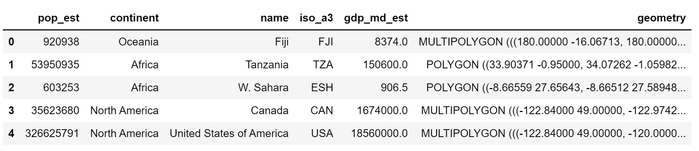|
|:--:|
|*Head of the `naturalearth_lowres` dataset of `Geopandas`*|

We have already explained how we built the template, resulting in 159 sentences. Unlike the process with first names, we only have one country name per sentence, and 177 possible countries. Hence resulting in total of `177`*`159`=`28143` possible sentences. Thus, it was possible to test every one of these possible sentences, and it is what we have done. To get the results of this experimentation, see the `results` part of this page. 

**City names**:

For city names, we did not use directly a Geopandas dataset but the [`World Cities Database`](https://simplemaps.com/data/world-cities) made available by  [`simplemaps`](https://simplemaps.com/). We used the basic - and thus free - one. It consists in a set of `37 499` unique cities in `237` countries. The additional information accessible through this dataset can be seen below:

|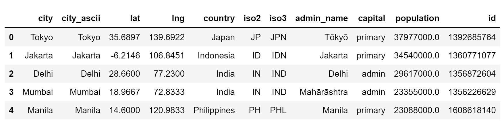|
|:--:|
|*Head of the World Cities Database by simplemaps*|

We noticed that some countries were only containing one city. This was the case for `Monaco` for instance. We decided not to use those kinds of cities because we wanted to compare the results of countries or continents. Thus, we only selected countries with more than 50 cities in the dataset, in order to have significant results. We now had 76 countries - over the 237 initially. Then, for each country we took the 10 cities with the largest population. Therefore, we now had 760 city names.    

To build the sentence template, we did not use the whole 760 city names. Instead, we randomly selected 100 city names, and looked for their wikipedia pages in order to use the exact same method we used with country names. We ended up with 64 sentences in the template. Thus, we had access to 760*64 = **48 640** possible sentences. We were then able to apply the four models on the whole set of sentences. We used the same validation method we used for first names. We were not really interested in the actual results for each city but in more global results so grouped the results by country and continent. This enabled us top plot some maps we are detailing in the `Results` part of this page. 

### :convenience_store: Company names 


---------------------

## :bar_chart: Results

Since we already detailed the methodology for each application, we are now going to get into the results, following the same programme: we will begin with the first names, then the geographical named entities and finally the company names. 

### First names

We are recalling that firstly we wanted to check the results of the article and then going a bit further by testing other potential biases on other datasets. 

#### On the first names of the article

We are showing below the results we got on **100 000** random sentences, which seemed quite significant already. Note that `avg_score` corresponds to the average score of the four models on each category, in order to have kind of the general bias of NER models. 

|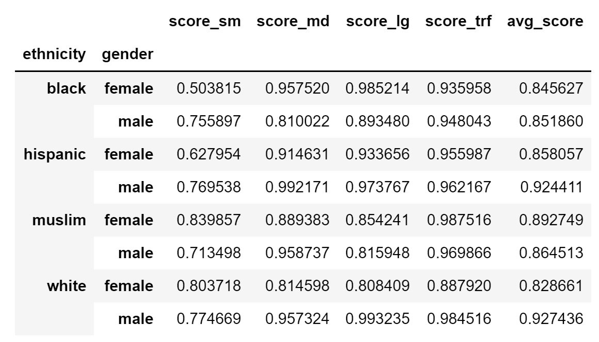|
|:--:|
|*Raw results of the models on the same first names as in the article*|

We can also detail the results for each category - ethnicity and gender:

|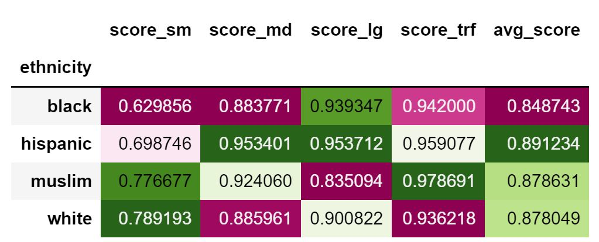|
|:--:|
|*Results for each ethnicity for the first names of the article*|

We can observe that the results are quite different than the one got in the article. For instance, `sm` scores are way higher in our test that in their. Yet, if we only compare each ethnicity, we can see that for `sm` the best results were obtained with `white` first names, and the lowest score for `black` first names. On average, `Muslim`, `Hispanic` and `White` performances were very close, and `Black` ones were quite lower, with at least 3 points drop down. **Therefore, our test quite moderates the results obtained in the article**. This difference can be explained by the fact we could not apply the models on every possible sentence, but also maybe because the models were trained a bit more since it was published in 2020.  

|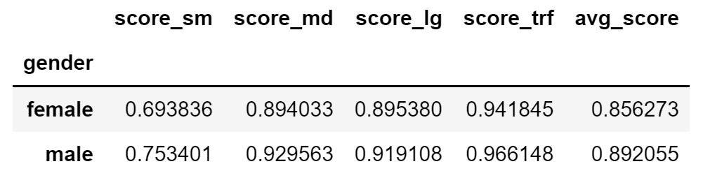|
|:--:|
|*Results for each gender for the first names of the article*|

Apart from that, we can notice the same kind of gender-based biases as they did in the article, every model performing better on `male` first names than on `female` ones. 

Anyway, given the limits of this experimentation we highlighted before, we are now going to perform the same kind of tests on over datasets. 

#### On the year with US baby names dataset

Then, we wanted to check if popularity of the names along the years could have an impact on the results of the NER models. We used the US baby names dataset at the national level. We show below the results for each model:

|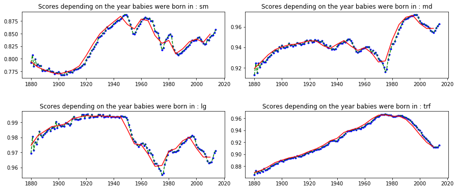|
|:--:|
|*Results of each models over time*|

We can notice large differences depending on the years people were born in, but we can also see that those results depend vastly on the model used for the NER tasks. This confirms that depending on the year people were born in, on average, they would get very different recognition by this type of algorithm. Hence confirming a potential age-based discrimination. 

Maybe the most interesting graph is the one of the `trf` model, because we can there clearly notice a bias on the recognition of first names towards the years, with an all-time high around 1980. We can therefore take a closer look on what datasets this model was trained on. The `trf` model was mainly trained on [roberta-base](https://huggingface.co/roberta-base). On the website, they are saying that *'The RoBERTa model was pretrained on the reunion of five datasets'*. Yet, in those 5 datasets, most of them are quite modern ones, for instance: 

- **Bookcorpus** is a collection of 11 038 open books from [Smashwords](https://www.smashwords.com/about), a platform launched in **2008**.
- **CC-News** is *'a dataset containing 63 millions English news articles crawled between September **2016** and February **2019**.'*
- **OpenWebText** consists mainly in **reddit** posts. 

Therefore, this is very interesting to see how the choice of datasets can have a great impact on the results of such a quite simple test, which is to say recognizing first names through NER models.

On the other hand, the `sm` model for instance was mainly trained on `OntoNotes 5`, and looking at its complete [documentation](https://catalog.ldc.upenn.edu/docs/LDC2013T19/OntoNotes-Release-5.0.pdf), and especially pages 5 and 6, we can clearly notice it was mainly trained on older datasets, which can explain the differences in the scores we got between `sm` and `trf`. Moreover, the increase from 1990 could be explained by the fact `OntoNotes 5` also contains a small amount of web texts. 

We can also plot the same graph giving there the average result of the four algorithms for each year:

||
|:--:|
|*Average results of the results over time*|

We can see that it's fluctuating around the same value from 1940 to today. Therefore, using different models for a NER task could be a good option in order to avoid age-based discrimination in the process of first names recognition through NER models. 

And finally, we can also check for which years the algorithms were given the best results on average:

|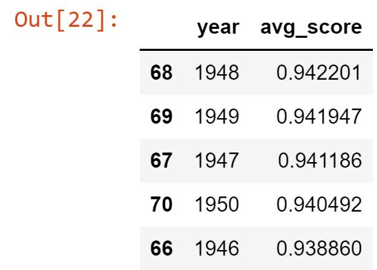|
|:--:| 
| *Figure n - best average scores depending on the year* |

We can notice that the best results were obtained for years just after WW2 - on average for the four models. 

#### On ethnicity and gender with the NYC dataset

We made the same kind of experimentations on the NYC dataset to check whether or not we could draw the same conclusions as the article, but based on another dataset. 
We firstly show the results we got on ethnicity:

|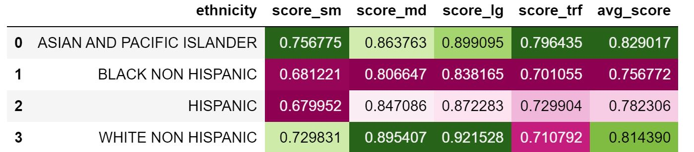|
|:--:|
|*Scores of the models depending on ethnicity*|

We notice that for `md` and `lg` models, the best results were got for the `White non hispanic` category, and that for every model the lowest results were on the `Black non hispanic` category, apart from the `sm` where the result for that ethnicity was very close - less than 0.2 points - to the `Hispanic` one. Those results quite confirm the conclusion of the article. Yet, the strange results we can observe, compared to the article, is that for the `sm` and `trf` models, the best scores were obtained for  `Asian and pacific islander`. We don't really know how to explain that. This gives, on average on the four models, `Asian and pacific islander` as the best recognized ethnicity, but quite close to `White non hispanic`, with a 1.5 difference, and `Black non hispanic` as the less recognized one, and by far, with a 5.7 difference. 
Therefore, we can say we can observe the same kind of biases the article had underlined. 

Let's now check the results over gender:

|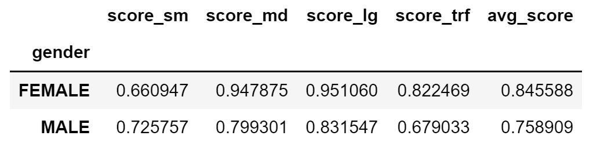|
|:--:|
|*Scores of the models depending on gender*|

Here, the results we obtained are very different from what the article had underlined, having only the `sm` model with a better score for `male` than for `female`. This gives, on average, a 8.7 difference between `Female` and `Male`, which is quite high. We then can highlight the presence of a bias, but in the other way around. One could argue that our results are more robust, because we selected the first names automatically from the NYC dataset and nothing was done by hand. 

#### On US states with the US baby names dataset

The final experimentation we conducted on first names was also on the US baby names dataset, but on state level, to check if the results were different depending on the states people were born in, resulting in a bias. 

|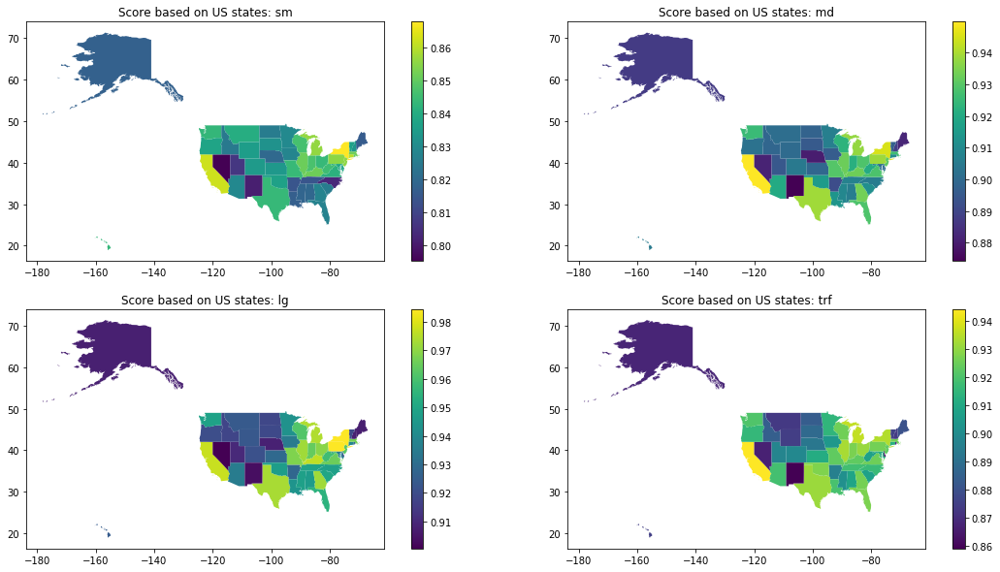|
|:---:|
|*Map of the scores for each model depending on the US states*|

We can plot the average score map too:

|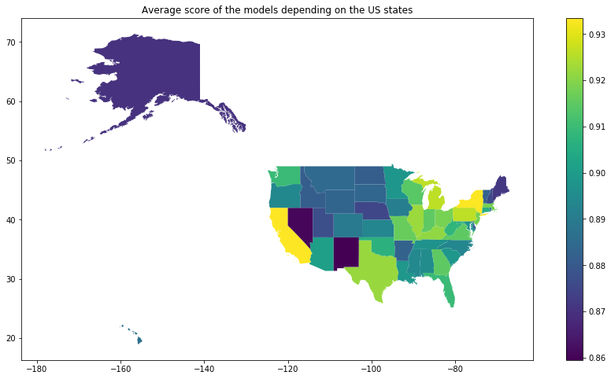|
|:---:|
|*Map of the average score of the models depending on the US states*|

We can also compute the list of the best results for each model:

|model|sm|md|lg|trf|
|-----|---|---|---|---|
|Best 5 scores|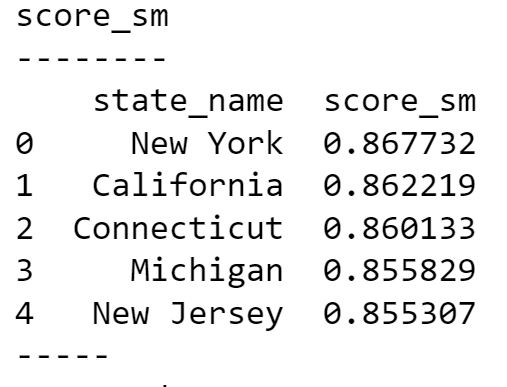|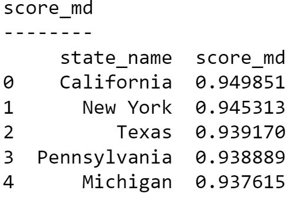|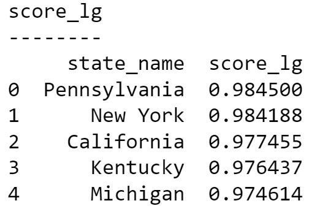|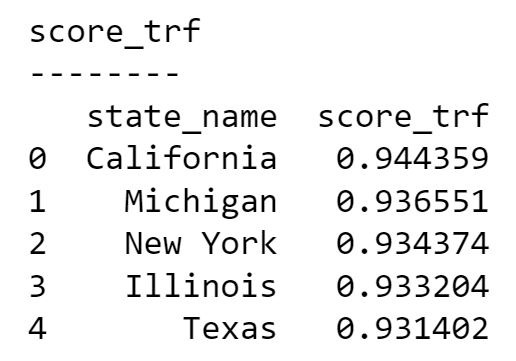|

Firstly, we can say that it's interesting, given that companies training and developing those algorithms mainly come from California, that this is for this state that the best results are obtained for most models. Moreover, New York and Pennsylvania are often in first positions too. 

We can now see the best results on average:

|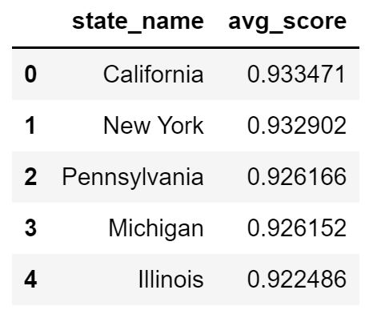|
|:--:|
|*5 best average scores on US states*|

Then, we can go a bit further in our analysis. This is why **we can also check where the datasets the models were trained on come from**.

|Dataset|University/company|State|
|-------|----------|-----|
|OntoNotes 5.0|BBN technologies <br/> University of Colorado <br/> University of Pennsylvania<br/>  University of Southern Californias Information Sciences Institute |Massachusetts <br/> Colorado <br/> Pennsylvania <br/> California |
|ClearNLP|Emory University|Georgia|
|WordNet 3.0|Princeton University|New Jersey|
|Glove| Stanford |California|
|roberta-base|huggingface|New York|

The three best results are obtained for three states the companies or universities developing the datasets come from. Moreover, over the 15 best results - of the average score - 6 (California, New York, Pennsylvania, New Jersey, Massachusetts, Georgia) of the 7 states the datasets come from are present, with only Colorado missing. 

|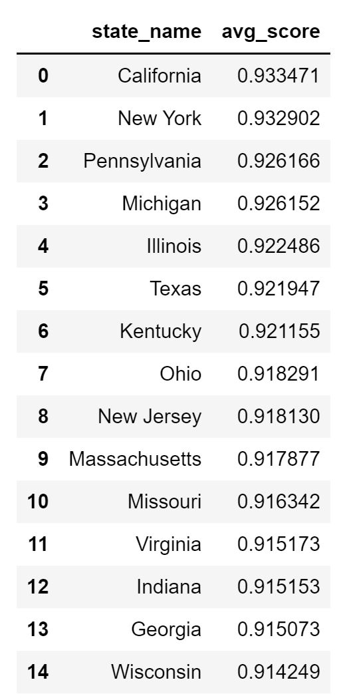|
|:--:|
|*15 best average scores on US states*|

We feel that this is quite remarkable, because yes, the texts the datasets were built on come from various places (wikipedia articles for instance), but a NLP dataset is not only made of texts - especially when we talk about NER processes - but it is also made of labels. We could then argue - and actually that's the all point of this paper - that people labelling the datasets have a great influence on possible biases. 


Yet, one could say that these states are also the most influent ones traditionally. Thus, secondly, we wanted to check wether or not those results were correlated with state wealth. This was encouraged considering our hypothesis, but also by the fact California and New York where the states with the best results. Moreover, we could find some similarities with this kind of map([^source_map]):  This is why we ran simple linear correlation with two datasets: 

- Median income per state. 
- GDP per capita per state.

*You can find the source of the datasets at the end of the page.*

We were then able to get correlation coefficient between our results and both datasets. We firstly show the table of the correlation with GDP per capita:

|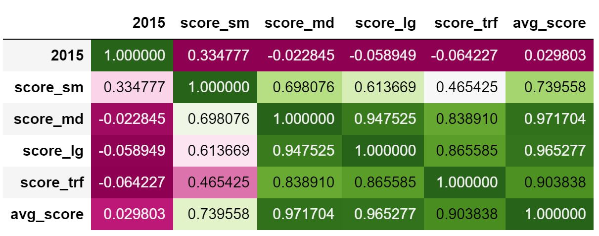|
|:---:|
|*Correlation coefficients between the scores of the models and the GDP per capita in 2015 for each US state*|

Secondly, we plot the table of correlation with median incomes:

|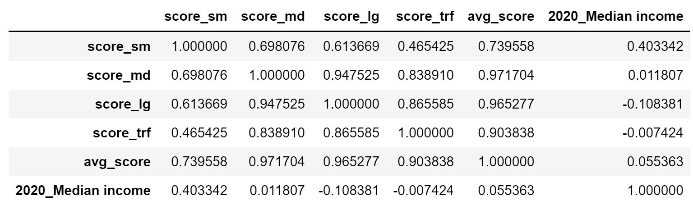|
|:---:|
|*Correlation coefficients between the scores of the models and the median income in 2020 for each US state*|

The results of the correlation coefficient were not really interpretable, and we are aware of that. Yet, the sm model gives a quite interesting correlation coefficient, with a correlation coefficient of 0.33 for GDP and 0.40 for median income. We know this is not a really good result from a scientific standpoint and we cannot really draw a conclusion from that. Yet, one could argue that this is already quite surprising that this coefficient is that high, given the fact that scores from a NER algorithm and GDP per capita are very different things. 

<!---Additionally to those correlation coefficients, we can also plot the scatterplot along with the regression line: 

|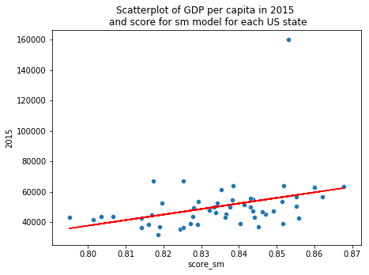|
|:---:|
|*Correlation between the sm model score and the GDP per capita in 2015 for each US state*|

|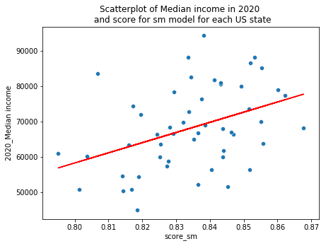|
|:---:|
|*Correlation between the sm model score and the median income in 2020 for each US state*|

Again, we are aware that those correlations are not really robust ones. Yet, it is quite -->

**Conclusion of the first names results:**

We observed that the results we obtained on the same first names as in the article were quite different than those of the paper. Yet, we were able to highlight some other and different biases, especially using other datasets: geographically-based, age-based and ethnically-based biases. Those biases can result in discriminations when using NER models. 

--------------------

### Geographical named entities

**Country names**

The first geographical named entity test we computed is on country names. 
The results are shown below, firstly with the scores for each model. 

|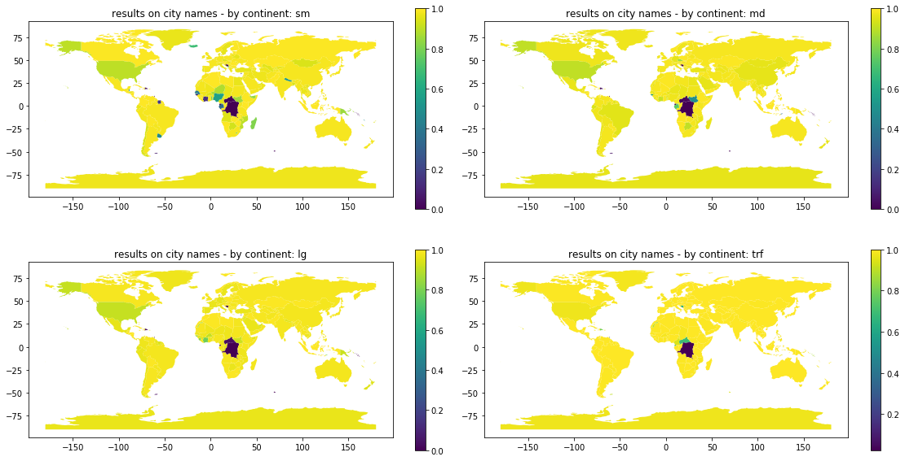|
|:--:|
|*Results on country names by country*|

Then with average results on country names by country. 

||
|:--:|
|*Average results on country names by country*|

By continent:

||
|:--:|
|*Average results on country names by continent*|

We can clearly see that there does not exist real differences between those results. Moreover, we are not completely sure about these results from a scientifical standpoint. Indeed, the main issue we had with country names is that there is not only one name for each country. For instance, in the `world` dataset from geopandas, the name of the USA was 'United States of America', but running a simple test we can clearly see that the results are quite different depending on how the name is implemented. 

||
|:--:|
|*Differences in the results of the models depending on the way the named entity is computed.*|

We then don't think that the results obtained for country names are really trustworthy. The other issue is that if the name of country is very long and the algorithm is just recognizing a part of it, the way we computed the validation makes it false. Moreover, one could think that the fact there is no real bias in the results of country names makes sense because there is not a lot of country, so the models could have learned them all. This is why we also tested the hypothesis on city names, as described in the methodology part of this page. 

**City names**

The results on city names are quite convincing that there exists a bias. 
Indeed, if we plot the mean scores by continent, we can clearly see that the best results are obtained for North America, with around 5 points better than Africa, South America and Europe. 

||
|:--:|
|*Average score of the four models on city names by continent*|

|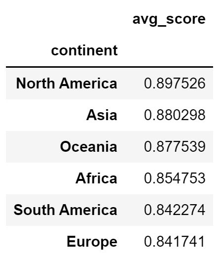|
|:--:|
|*Average scores for each continent on city names*|

Additionally, the same kind of results are obtained for every models, apart from the trf one - South America outperforming North America-, but with very close scores: 

|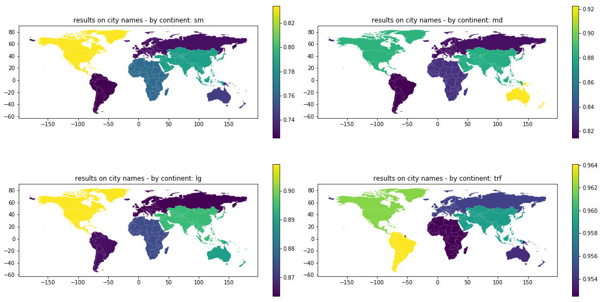|
|:--:|
|*Scores of each of the four models on city names by continent*|

This kind of biases does not highlight ones which could really lead to real-life discriminations, but it could underline geographical differences in the way models were trained. We could still think that if a NER model is used for an anonymization task, people born in European cities could see the place they were born in unremoved by the algorithm. 

**Conclusion of the geographical named entities**

We did not obtain consequent results with country names, but this seems logical because the models can have learned every country names since there is a few of them and it seems like a very basic thing. At the opposite, we were able to see that there were real biases with city names. Even if they don't really lead to discriminations, it is still interesting because this could lead to invisibilizing some places if NER algorithms are used on some websites - to tag cities automatically for instance. 

### Company names


<!-------The same kind of method has been used on company names. Possible biases in this field could have great consequences because it would mean that if non-western company names are less recognized by these algorithms than western ones, those companies could end up being less tagged on press article for instance. Obtaining results for company names was actually very difficult, for different reasons. Indeed, one should not compare companies which are too different. For instance, just like we saw that Californian first names were the most recognized in America, we could think - from who is actually training the models - that tech companies are more recognized than construction ones. The other thing that could bias the search for these biases is the choice of company depending on the size of it. 
--->

----------------------------------------

### Limits / Possible improvements

Additionally, we have been given restricted time for this project and therefore could not apply everything we wanted but here are some of the main possible improvements:

- 1- Applying the models to every possible sentences. 

This has been developed inside the notebooks but given our computational power we could not apply the model to every possible sentences for most of the explored biases. Indeed, this is what they were doing in the article, but our computational power allowed us to compute the results on 100 000 sentences for the four models in about 2 hours. 

- 2- Using another validation method. 

As we said, we validated the models if and only if the complete substring consisting in the named entity was indeed contained inside the spacy prediction string. This method seems correct, but it can worsen the results of long named entity strings. Yet, it is a quite difficult issue, because one could argue that if the complete named entity is not recognized it's not good either. We could have computed some kind F_beta score, but in order to do that we would have to make sure there wasn't any other named entity inside the sentence. This was not possible for most of our experimentations, especially with the first names since it consisted in three first names per sentence. 

- 3- Exploring the label of the results. 

The other main improvement could have been to check if the named entity were recognized as what they actually are. For instance, a person name could be recognized by the algorithm as a company name, but given our validation procedure we did not check that. Exploring the label could add different elements to the project. Possible new biases could emerge: are white people first names recognized by the algorithm more recognized as a person name than those of a different ethnicity for instance? Another metric could also have been implemented. 

------------------------------------------------------------

## General conclusion

To conclude, we clearly identified some biases. Those biases could result in strong discriminations, especially with the example of first names
- Anonymization
- Internet visibility
- ... 

One answer in trying to avoid these biases could be to apply several models - as we seen with age-based discrimination on the US Baby names dataset. 

Yet, more than the biases, what we find interesting in that project is that we could almost guess what - at least the type of - data was used to train the models, just based on the results obtained by NER algorithms on first names recognition, as we did geographically and over time with the US baby names dataset. 

Therefore, one should be very careful when using NER algorithms, and maybe should see what the best model for its use case is - if it's impossible to use several ones. 


--------------------------------------------

## Technical information

----------------------------------------

### Github and notebooks

The complete code for this project is accessible on the associated Github Repo here. Some data could not have been posted in the repo because they were too large, but the complete list of datasets used for this project is written below. 

The Repo contains four main notebooks:


------------------------------------

### Installations

|Package name|Description and ways to install it|Doc link|
|------------|----------------------------------|--------|
|Spacy (v3.0 or superior)|Spacy v3.1 is used to complete the task. Following the [Spacy installation guide](https://spacy.io/usage), this is the lines you need to enter to install Spacy: <br/>```pip install -U pip setuptools wheel``` <br/> ```pip install -U spacy ```<br/>Note that version 3.0 or superior is needed to use the transformer model.To install the models inside spacy: <br/> ```python -m spacy download en_core_web_sm```<br/>You just have to replace the model name by the one you want to install. <br/> A list of the models available in Sapcy is available [here](https://spacy.io/usage/models).|[Spacy Documentation](https://spacy.io/)|
|Wikipedia|To install the wikipedia package, you cas use pip, following this [installation guide](https://pypi.org/project/wikipedia/).<br/>```pip install wikipedia```<br/>This package is helping us to build templates for the sentences, in order to use real sentences to test the model.|[Wikipedia API documentation for Python](https://pypi.org/project/wikipedia/)|
|Geopandas|Geopandas is useful when dealing with geographic datasets.<br/>It is used inside this project :<br/>1) To plot some maps <br/>2) To access geo datasets - made available inside the package. <br/>You can also use pip to install it : <br/>```!pip install --upgrade geopandas```<br/>If using Google collab, you may want to add these lines - and these packages - to make it work : <br/>```!pip install --upgrade pyshp```<br/>```!pip install --upgrade shapely```<br/>```!pip install --upgrade descartes```<br/>|[Geopandas Documentation](https://geopandas.org/)|

#### Other packages

We also used other packages available in Python, but quite common ones. 

For instance, we used `tqdm` to be able to check the process and its final time. 

-------------------------

### :file_cabinet: Datasets used for this project: 

|Field|Name|Description|Source|
|-----|----|-----------|------|
|First names|list of first names given in the article|The dataset consisted in 15 or 16 first names for each ethnical and gender category. <br /> This dataset was completely described in the above `methodology` part of this page. |[Article](https://arxiv.org/pdf/2008.03415.pdf)|
|First names|`Winogender Schemas`|This dataset provided us with a sentence template. <br /> Each sentence contained three possible entities: `OCCUPATION`, `PARTICIPANT` and a `PRONOUN`. <br /> After cleaning the dataset to avoid mistakes, it enabled us to build 89 correct sentences to test the models on. <br /> The specific dataset we used was [this one](https://github.com/rudinger/winogender-schemas/blob/master/data/templates.tsv). |[Winogender-Schemas on Github]()|
|First names|`US baby names` - nation|We used the dataset at the national level to compute a score for each year.| Transformed version on [Kaggle](https://www.kaggle.com/kaggle/us-baby-names). Raw one coming from Data.gov|
|First names|`US baby names` - states|The dataset at the state level was used to compute the scores of the models depending on the state people with each first names were born in. <br /> This allowed us to compute US maps as shown in the results part of this page.  |Transformed version on [Kaggle](https://www.kaggle.com/kaggle/us-baby-names). Raw one coming from Data.gov|
|First names|`Popular Baby Names`|This dataset consists in information about babies born in New York City between 2012 and 2017. <br /> It contains information about Child's First Names, Mother's Ethnicity, Year of Birth, Gender and count if there are individuals with the exact same characteristics. |[NYC Open Data](https://data.cityofnewyork.us/Health/Popular-Baby-Names/25th-nujf)|
|Additional dataset for first names|`States 21Basic`|This dataset was used to access to the geometry of each US state to plot the results on a map.|[Socrata](https://alicia.data.socrata.com/Government/States-21basic/jhnu-yfrj)|
|Additional dataset for first names|`Median Income for each state`|This dataset from the US Census Bureau contains the median income in dollar for each US state.|[United States Census Bureau](https://www.census.gov/data/tables/time-series/demo/income-poverty/historical-income-households.html)|
|Additional dataset for first names|`GDP per capita for each US state`|The dataset consists in the GDP per capita for each US state from 1997 to 2015, in dollars.|[BEA on data.world](https://data.world/gmoney/gdp-per-capita-by-state)|
|Geographical named entities|`naturalearth_lowres`|The dataset consists in a list of the countries with their associated countours, continent and estimated population. <br />This dataset can be accessed symply by computing this code: `world = geopandas.read_file( gpd.datasets.get_path( 'naturalearth_lowres' ))` when Geopandas is installed in the distribution|[Geopandas](https://geopandas.org/en/stable/)|
|Geographical named entities|`World Cities Database`|The dataset used for this project was the basic - and thus free - one. <br /> It consists in prominent cities (large, capitals etc.), with around 40 thousands entities. <br /> There are also the GPS coordinates of the city, its associated country and population.|[simplemaps](https://simplemaps.com/data/world-cities)|
|Companies|`7+ Million Company Dataset`|This dataset provided us with a very large list of companies, with some additional information, such as their specific industry, their size, their country or their estimated number of employees. <br /> Given the size of this dataset (around 1.09GB), it has not been posted on GitHub |[People Data Labs](https://www.kaggle.com/peopledatalabssf/free-7-million-company-dataset)|

-------------------

[^limits_article] *"We are aware that our work is limited by the availability of names from various demographics, and we acknowledge that individuals will not-necessarily identity themselves with the demographics attached to their first name, as done in this work."* - [article](https://arxiv.org/pdf/2008.03415.pdf)

[^source_map] Article 