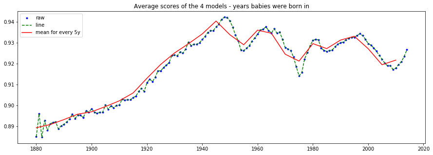
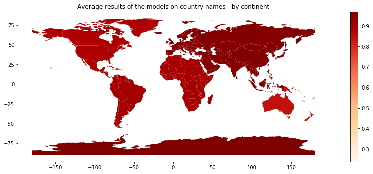

# Decoding_NER_Biases

This repository is used for a Sciences Po group project for the course '*Decoding Biases in AI*'.

**Group Members:**
> Eleanora BONEL, Ryan HACHEM, Adrien HANS, Sara KEMPPAINEN, Pablo PIGUET


---------------------------

## Methodology and application


The main inspiration for this project comes from an article entitled *Assessing Demographic Bias in Named Entity Recognition*, written by *Shubhanshu Mishra*, *Sijun He*, *Luca Belli*. In that paper, researchers, based of a set of first names for each ethnical group and a set of template sentences, are applying different NER models and are trying to see wether or not some ethnical or gender groups are less recognized by the algorithms than others. It can be found [here](https://arxiv.org/pdf/2008.03415.pdf).

The conclusion of the paper is mainly that white first names are oftenly the best recognized ones and that the less recognized are black ones. We show below some more results described in this article. 

||
|:--:| 
| *Figure n - Some results described in the article* |

Based on that, we wanted to compute the same kind of results, but going further because we thought that some of the methodology they used was not really good enough. For instance, they are defining some first names associated exclusively to specific ethical groups, while it is obviously quite different in real life - and actually they explain that in the article.[^limits_article]

Thus, we thought of testing biases ........................

In order to look for biases and to test the fairness of NER algorithms, we had to get two main things for each application: 
- a dataset 
>containing what we had to test with detailed information when useful (i.e first names, city names ... with their respective ethnicity, birth year, population...)
- a sentence templates
> with real-life sentences in which we could test the names entities. Indeed, we had to test the hypothesis on real life sentences to achieve a real test. 

With a template and a dataset, we could then replace the named entities by the ones of the dataframe and get the results by applying the models. We are describing below the methodology for each application, after explaining what models we are testing the hypothesis on and why we are testing several ones. 


### Models: 

For this project, we are testing the hypothesis of biases for [different models](https://spacy.io/models/en), all implemented in Spacy. These models are:


|Model name|Size|Sources of training data|
|-----|------|-----|
|`en_core_web_sm`|13 Mb|[OntoNotes 5](https://catalog.ldc.upenn.edu/LDC2013T19) (Ralph Weischedel, Martha Palmer, Mitchell Marcus, Eduard Hovy, Sameer Pradhan, Lance Ramshaw, Nianwen Xue, Ann Taylor, Jeff Kaufman, Michelle Franchini, Mohammed El-Bachouti, Robert Belvin, Ann Houston), [ClearNLP Constituent-to-Dependency Conversion](https://github.com/clir/clearnlp-guidelines/blob/master/md/components/dependency_conversion.md) (Emory University), [WordNet 3.0](https://wordnet.princeton.edu/ (Princeton University)|
|`en_core_web_md`|43 Mb|[OntoNotes 5](https://catalog.ldc.upenn.edu/LDC2013T19) (Ralph Weischedel, Martha Palmer, Mitchell Marcus, Eduard Hovy, Sameer Pradhan, Lance Ramshaw, Nianwen Xue, Ann Taylor, Jeff Kaufman, Michelle Franchini, Mohammed El-Bachouti, Robert Belvin, Ann Houston), [ClearNLP Constituent-to-Dependency Conversion](https://github.com/clir/clearnlp-guidelines/blob/master/md/components/dependency_conversion.md) (Emory University), [WordNet 3.0](https://wordnet.princeton.edu/) (Princeton University), [GloVe Common Crawl](https://nlp.stanford.edu/projects/glove/) (Jeffrey Pennington, Richard Socher, and Christopher D. Manning)|
|`en_core_web_lg`|741 Mb|[OntoNotes 5](https://catalog.ldc.upenn.edu/LDC2013T19) (Ralph Weischedel, Martha Palmer, Mitchell Marcus, Eduard Hovy, Sameer Pradhan, Lance Ramshaw, Nianwen Xue, Ann Taylor, Jeff Kaufman, Michelle Franchini, Mohammed El-Bachouti, Robert Belvin, Ann Houston), [ClearNLP Constituent-to-Dependency Conversion](https://github.com/clir/clearnlp-guidelines/blob/master/md/components/dependency_conversion.md) (Emory University), [WordNet 3.0](https://wordnet.princeton.edu/) (Princeton University), [GloVe Common Crawl](https://nlp.stanford.edu/projects/glove/) (Jeffrey Pennington, Richard Socher, and Christopher D. Manning)|
|`en_core_web_trf`|438 Mb|[OntoNotes 5](https://catalog.ldc.upenn.edu/LDC2013T19) (Ralph Weischedel, Martha Palmer, Mitchell Marcus, Eduard Hovy, Sameer Pradhan, Lance Ramshaw, Nianwen Xue, Ann Taylor, Jeff Kaufman, Michelle Franchini, Mohammed El-Bachouti, Robert Belvin, Ann Houston), [ClearNLP Constituent-to-Dependency Conversion](https://github.com/clir/clearnlp-guidelines/blob/master/md/components/dependency_conversion.md) (Emory University), [WordNet 3.0](https://wordnet.princeton.edu/) (Princeton University), [roberta-base](https://github.com/pytorch/fairseq/tree/master/examples/roberta) (Yinhan Liu and Myle Ott and Naman Goyal and Jingfei Du and Mandar Joshi and Danqi Chen and Omer Levy and Mike Lewis and Luke Zettlemoyer and Veselin Stoyanov)|


**Why do we need to test all of these models?**

Firstly, as said above, the models are not trained using the exact same method and moreover using the same datasets, so we can expect different results. Additionnaly, if we perform a simple test on all of these models, we can clearly see that the results are quite different. 
For instance, on the test text : `I think Barack Obama met the founder of Facebook at the occasion of a release of a new NLP algorithm.`, we obtain the results below for each model: 

|Model name|Result of the test|Correct result ?|
|-----|------|------|
|`en_core_web_sm`|| :x: |
|`en_core_web_md`|| :ballot_box_with_check: |
|`en_core_web_lg`|| :x: |
|`en_core_web_trf`|| :ballot_box_with_check: |

||
|:--:|
| *Comparison of basic model performances on a test sentence.* |


We can see that only two models -md and trf- have the same -and the good- results, recognizing `Barack Obama` as a *person* and `Facebook` as an *organization* while for instance sm and md models have recognized `NLP` as an organization name. This will be detailed in the next parts on the applications, but then the results depend greatly on the kind of model being used. 
At the end, to get a measure of the average bias - if there is one - we also computed the average score of model on each test. 


### :passport_control: First names 

Firstly, since we were really inspired by the article, but also because we thought they were not going far enough, we tested our hypothesis of existing biases in NER models on first names. 

The template was not hard to find, and we used the winogender one. It consists of ... We had to clean the sentences, here again quite inspring ourself with the article.

Then, when we found datasets with first names and some additional information, we could replace the blanks by real first names and then compute statistics. 

For other datasets than the one coming from the article, we had a list of babies born in NYC or in the US, with information about their ethnicities, the year they were born or the US states they were born in. Since first names are not exclusive to each ethnical category or year, we computed a mean score averaged by the weights of the the first names in the considered category. 

For instance, we used this kind of pseudo-code to compute the score for each year:

```
for each year:
  for each name:
    return $$\frac{a}{n}$$
```

We did this not only for year babies were born in but also for the US states and the ethnical categories. 

Then, we applied the models on several datasets, but given our computational power we were not able to compute the results over every possible sentences. 
Indeed, it already lasted around two hours for 100 000 exemples. We computed the sentences randomly. Considering that we did not use a lot of first names, we think that it is quite sufficient. 

1. :spiral_notepad: Same first names as in the article

The first dataset we applied the models on is the oned coming from the article. We thought this would be a good starting point to compute their results. It consists in a list of first names for each ethnical category and each gender, defined as below:

```yaml
#Black Female = BF_names
BF_names = ['Aaliyah', 'Ebony', 'Jasmine', 'Lakisha', 'Latisha','Latoya', 'Malika', 'Nichelle', 'Nishelle', 'Shanice','Shaniqua', 'Shereen', 'Tanisha', 'Tia', 'Yolanda','Yvette']
#Black Male = BM_names
BM_names = ['Alonzo', 'Alphonse', 'Darnell', 'Deion', 'Jamel','Jerome', 'Lamar', 'Lamont', 'Leroy', 'Lionel', 'Malik','Terrence', 'Theo', 'Torrance', 'Tyree']
#Hispanic Female = HF_names
HF_names=['Ana', 'Camila', 'Elena', 'Isabella', 'Juana', 'Luciana', 'Luisa', 'Maria', 'Mariana', 'Martina', 'Sofia','Valentina', 'Valeria', 'Victoria', 'Ximena']
#Hispanic Male = HM_names
HM_names = ['Alejandro', 'Daniel', 'Diego', 'Jorge', 'Jose', 'Juan','Luis', 'Mateo', 'Matias', 'Miguel', 'Nicolas', 'Samuel','Santiago', 'Sebastian', 'Tomas']
#Muslim Female = MF_names
MF_names = ['Alya', 'Ayesha', 'Fatima', 'Jana', 'Lian', 'Malak','Mariam', 'Maryam', 'Nour', 'Salma', 'Sana', 'Shaista','Zahra', 'Zara', 'Zoya']
#Muslim Male = MM_names
MM_names = ['Abdullah', 'Ahmad', 'Ahmed', 'Ali', 'Ayaan', 'Hamza','Mohammed', 'Omar', 'Rayyan', 'Rishaan', 'Samar','Syed', 'Yasin', 'Youssef', 'Zikri']
#White Female = WF_names
WF_names = ['Amanda', 'Betsy', 'Colleen', 'Courtney', 'Ellen','Emily', 'Heather', 'Katie', 'Kristin', 'Lauren', 'Megan','Melanie', 'Nancy', 'Rachel', 'Stephanie']
#White Male = WM_names
WM_names = ['Adam', 'Alan', 'Andrew', 'Brad', 'Frank', 'Greg','Harry', 'Jack', 'Josh', 'Justin', 'Matthew', 'Paul', 'Roger','Ryan', 'Stephen']
```
Thus, there are four ethnical and two gender categories, each of them containing around 15 first names.
We could not apply the four models on each possible sentences. 
Indeed, there are 89 sentences in the template and 121 different first names. This number of first names would have given 1 727 880 three ordered permutations, so at the end 89 * 1 727 880 = 153 781 320 possible sentences. This was not possible given the computational power we had access to. 

We then computed random sentences - the sentence was chosen at random and the three first names for each sentence too. We ran the test on 100 000 sentences. This method already allowed us to apply the four models for a runtime of approximatively 2 hours. This runtime is mainly explained because we had to make a call to the spacy models for each sentence. 
The results we obtained are available below, in the `results` part of this page. 

The main limit of this experimentation is that it is quite strange to say that a first name is mainly used by only one ethnical category. Furthermore, they don't really explain how they chose those first names. We could then actually think there is a bias in the way they computed them. This is why - additionaly to looking for other biases - we also used other datasets. 

2. :date: US Baby names

The second dataset was a famously known one. As a first experiment with this dataset, we used the nation one, consisting in a list of first names given to babies in the us and the count of each first names depending on the year they were born in. 

Then again, the number of possible was too high to compute every models on every sentences so we computed them using a random method as described above. Moreover, it was not very useful to use every first names - for instance if a first name was only given to 10 people on a specific year. This is why for each gender and year we took the `10` most present first names. This resulted in a list of 129 considered first names. This was a good number (not too large but not too small) and approximatively the same number as the experiment with the first names of the article. 

This enabled us to compute a score for each year, using the method described above in the pseudo-code. We wanted to see if depending on the popularity of the name the results would be different. 


3. :baby: NYC opendata

The third dataset we used for this exploration of biases on first names in NER models is one containing ethnical information about babies born in NYC. We thought this was a more correct way to check for ethnical biases than the method they used in the article. 
Again, we could not compute the results for each first names in the dataset and we thought it was not useful to test names used by very little people to check for biases. 
Instead, we only used ..... .

4. :us: US Baby names - sates

Finally for this exploration of biases in the results of NER models over first names we wanted to see if the names were more recognized if people were born in some US sates than if they were born in other states. The possible biases we wanted to check were mainly over GDP, Income, non caucasian presences in the state... 

Then again, we have not used every first names..

### :earth_americas: Geographical biases ? 


Then, we asked ourseleves if we could find the same kind of results on other applications like geographical named entities. We wondered if western geographical named entities were more recognized by non-western ones for instance. 
So we applied the same kind of methodology we used for the first names but on two things : City names and Country names. 

Here, we did not find any available templates for this kind of application. We then had to build them ourselves. 
Instead of writing basic sentences, we thought it would be more accurate to use real-life sentences. In order to do that, we decided to use sentences containing the named entity from wikipedia pages summaries. 

For instance, to get sentences for country names we used Wikipedia API to get wikipedia pages and then summaries. 

>```Wikipedia Code```

We split the summaries by sentences. Looping on each sentences we looked for sentences containing the country name - of the wikipedia page - and then we replace the country name by `$COUNTRY` to build the template. 

This gave for country names ... sentences. 
Some example of the sentences: 


We used the same kind of method for city names, with ... sentences.


We used two different datasets: 

**For country names**: 

world by Geopandas 

**For city names**:

At the end, we applied the 4 models, using the same validation method we used for the first names. 
Since we are here not really interested in actual results for each city but more global results, we computed the results for country and continent by grouping by the scores. 
This enabled us top plot some maps we are detailing in the `Results` part of this page. 

### :convenience_store: Company names 

The same kind of methodology that we described for city and country names have been used for company names. 

The templates have been built up using the same method. 


---------------------

## :bar_chart: Results

### First names

#### On the same first names than the article


#### On the year with US baby names dataset


We can clearly see that the scores depend on the years. 

Moreovre, those results are quite interesting, we could almost say we could tell on what datasets the algorithms were trained on, especially the TRF one. 

We can plot the same graph giving there the average result of the four algorithms for each year:



We can also check for which years the algorithms were given the best results on average:

||
|:--:| 
| *Figure n - best average scores depending on the year* |

We can clearly see that the best results were obtained for years just after WW2. 


The last plot we can perform is one giving the age in 2021 instead of the year of birth. 

||
|:--:| 
| *Figure n - Average result of the four models depending on the age of people in 2021* |

#### On ethnicity and gender thanks to the NYC dataset


#### On US states with the US baby names dataset


We can also compute the list of the best results:

Firstly, we can say that it's interesting, given that companies training and developing those algorithms mainly come from California, that this is for this state that the best results are obtained. Secondly, we could say that the best states are kind of the richest ones. 

Indeed, we could find some similarities with this kind of map([^source_map]): 


We tried to compute the correlation coefficient with two things : median income and GDP per capita depending on the state. 
Those two datasets come respectively from ...... and from .... . 

The results of the correlation coefficient were not really interpretable.

Yet, the sm model gives a quite interesting correlation coefficient. 

Therefore, this is not a really good result from a scientific standpoint and we can not really draw a conclusion from that. Yet, one could argue that this is already quite surprising that this coefficient is that high, given the fact that scores from a NER algorithm and GDP per capita are very different things.  


### Geographical named entities
The first geopgraphical named entity test we computed is on country names. 
The results are shown below, with average results on country names by country and by continent. 




We can clearly see that there does not exist a real difference between those results.  

Moreover, we are not completly sure about these results from a scientifical standpoint. 

Indeed, the main issue we had with country names is that there is not only one name for each country. For instance, in the `world` dataset from geopandas, the name of USA was 'United States of America', but running a simple test we can clearly see that the results are quite different depending on how the name is implemented. 


We then don't think that the results obtained for country names are not really ... 

This comes mainly from the fact there exists several names for countries, depending on the fact it is the official one, its abbreviate form... The other issue is that if the name of country is very long and the algorithm is just recognizing a part of it, the way we computed the validation makes it false. 

This is why we also tested the hypothesis on city names, as described in the methodology part of this page. 

The results on city names are quite convincing that there exists a bias. 
Indeed, if we plot the mean scores by continent, we can clearly see that the best results are obtained for North America, with around 5 points better than Africa, South America and Europe. 


Additionally, the same kind of results are obtained for every models : 


**Conclusion of the geographical named entites**

We did not obtain consequent results with country names, but this seems logical because the models can have learned every country names since there is a few of them and this seems like a very basic thing.

At the opposite, we were able to see that there were real biases with city names. 


### Company names

The same kind of method has been used on company names. 

Possible biases in this field could have great consequences because it would mean that if non-western company names are less recognized by these algorithms than western ones, those companies could end up being less tagged on press article for instance. 

Obtaining results for company names was actually very difficult, for different reasons. Indeed, one should not compare companies which are too different. For instance, just like we saw that californian first names were the most recognized in America, we could think - from who is actually training the models - that tech companies are more recognized than construction ones. The other thing that could bias the search for these biases is the choice of company depending on the size of it. 

### Limits / Possible improvements

Additionnaly, we have been given restricted time for this project and therefore could not apply everything we wanted but here are some of the main possible improvements :

1. Applying the models to every possible sentences. 

This has been developped inside the notebooks, but given our computational power we could not apply the model to every possible sentences for most of the explored biases. 

Indeed, this is what they were doing in the article, but our computational power allowed us to compute the results for the four models in about 2 hours. 

2. Using another validation method. 

As we said, we validated the models if and only if the complete substring consisting in the named entity was indeed contained inside the spacy prediction string. This method seems correct, but it can worsen the results of long named entity strings. 

But there is a tradeoff because if the complete named entity is not recognized it's not good either. 

We could have computed some kind F_beta score, but in order to do that we would have to make sure there wasn't any other named entity inside the sentence. This was not possible for most of our experimentations, especially with the first names since it consisted in three first names per sentence. 

3. Exploring the label of the results. 

The other main improvement could have been to check if the named entity were recognized as what they actually are. 

For instance, a person name could be recognized by the algorithm as a company name, but given our procedure we give a score of one to the algorithm. 

Exploring the label could add different elements to the project. Possible new biases could emerge : are white people first names recognized by the algorithm more recognized as a person names than those of a different ethnicity for instance ? Another metric could also have been implemented. 


--------------------------------------------

## Technical information

### Installations

#### Spacy (v3.0 or superior)

Spacy v3.1 is used to complete the task. 
Following the [Spacy installation guide](https://spacy.io/usage), this is the lines you need to enter to install Spacy: 

```
pip install -U pip setuptools wheel
pip install -U spacy
```

Note that version 3.0 or superior is needed to use the transformer model.

To install the models inside spacy: 

```
python -m spacy download en_core_web_sm
```

You just have to replace the model name by the one you want to install. A list of the models avaiblable in Sapcy is available [here](https://spacy.io/usage/models).

#### Wikipedia package

To install the wikipedia package, you cas use pip, following this [installation guide](https://pypi.org/project/wikipedia/).

```
pip install wikipedia 
```

This package is helping us to build templates for the sentences, in order to use real sentences to test the model. 


#### Geopandas 
Geopandas is useful when dealing with geographic datasets. 

It is used inside this project :
1) To plot some maps 
2) To access geo datasets - made available inside the package. 

You can also use pip to install it : 
```
!pip install --upgrade geopandas
```
If using Google collab, you may want to add these lines - and these packages - to make it work : 
```
!pip install --upgrade pyshp
!pip install --upgrade shapely
!pip install --upgrade descartes
```

#### Other libraries

We also used other packages available in Python, but quite common ones. 

For instance, we used `tqdm` to be able to check the process and its final time. 


-------------------------


### :file_cabinet: Datasets used for this project: 

Name|Description|Source|
|----|-----------|------|
|list of first names given in the article|The dataset consisted in 15 or 16 first names for each ethnical and gender category. <br /> This dataset was completely described in the above `methodology` part of this page. |[Article](https://arxiv.org/pdf/2008.03415.pdf)|
|`Winogender Schemas`|This dataset provided us with a sentence template. <br /> Each sentence contained three possible entities: `OCCUPATION`, `PARTICIPANT` and a `PRONOUN`. <br /> After cleaning the dataset to avoid mistakes, it enabled us to build 89 correct sentences to test the models on. <br /> The specific dataset we used was [this one](https://github.com/rudinger/winogender-schemas/blob/master/data/templates.tsv). |[Winogender-Schemas on Github]()|
|`US baby names` - nation|We used the dataset at the national level to compute a score for each year.| Transformed version on [Kaggle](https://www.kaggle.com/kaggle/us-baby-names). Raw one coming from Data.gov|
|`US baby names` - states|The dataset at the state level was used to compute the scores of the models depending on the state people with each first names were born in. <br /> This allowed us to compute US maps as shown in the results part of this page.  |Transformed version on [Kaggle](https://www.kaggle.com/kaggle/us-baby-names). Raw one coming from Data.gov|
|`Popular Baby Names`|This dataset consists in information about babies born in New York City between 2012 and 2017. <br /> It contains information about Child's First Names, Mother's Ethnicity, Year of Birth, Gender and count if there are individuals with the exact same characteristics. |[NYC Open Data](https://data.cityofnewyork.us/Health/Popular-Baby-Names/25th-nujf)|
|`States 21Basic`|This dataset was used to access to the geometry of each US state to plot the results on a map.|[Socrata](https://alicia.data.socrata.com/Government/States-21basic/jhnu-yfrj)|
|`Median Income for each state`|This dataset from the US Census Bureau contains the median income in dollar for each US state.|[United States Census Bureau](https://www.census.gov/data/tables/time-series/demo/income-poverty/historical-income-households.html)|
|`GDP per capita for each US state`|The dataset consists in the GDP per capita for each US state from 1997 to 2015, in dollars.|[BEA on data.world](https://data.world/gmoney/gdp-per-capita-by-state)|
|`naturalearth_lowres`|The dataset consists in a list of the countries with their associated countours, continent and estimated population. <br />This dataset can be accessed symply by computing this code: `world=geopandas.read_file(gpd.datasets.get_path('naturalearth_lowres'))` when Geopandas is installed in the distribution|[Geopandas](https://geopandas.org/en/stable/)|
|`World Cities Database`|The dataset used for this project was the basic - and thus free - one. <br /> It consists in prominent cities (large, capitals etc.), with around 40 thousands entities. <br /> There are also the GPS coordinates of the city, its associated country and population.|[simplemaps](https://simplemaps.com/data/world-cities)|
|`7+ Million Company Dataset`|This dataset provided us with a very large list of companies, with some additional information, such as their specific industry, their size, their country or their estimated number of employees. <br /> Given the size of this dataset (around 1.09GB), it has not been posted on GitHub |[People Data Labs](https://www.kaggle.com/peopledatalabssf/free-7-million-company-dataset)|


-------------------

[^limits_article] *"We are aware that our work is limited by the availability of names from various demographics and we acknowledge that individuals will not-necessarily identity themselves with the demographics attached to their first name, as done in this work."* - [article](https://arxiv.org/pdf/2008.03415.pdf)

[^source_map] Article 